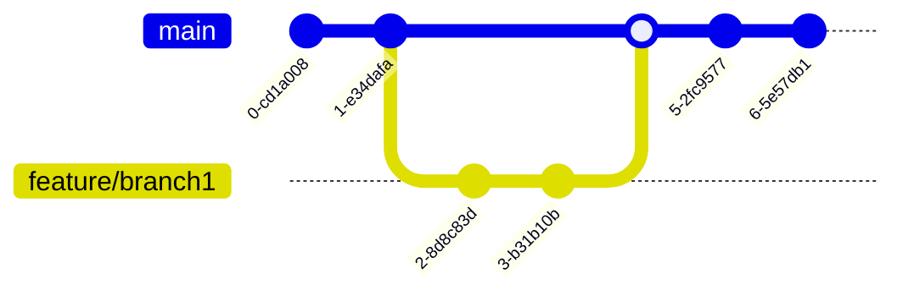

# Guía de contribución

Esta página explica cómo reportar problemas y las pautas para contribuir al proyecto.

## Flujo de contribución

1. Alguien abre un issue para reportar un bug o proponer cambios.
2. Los encargados etiquetan los issues (por ejemplo, `duplicate`, `blocked`, `needs owner`, `needs info`, `wontfix`, `breaking change`) para priorizar.
3. Voluntarios manifiestan interés en resolver un issue.
4. Encargados asignan el issue a un responsable.
5. El responsable envía un pull request con los cambios.
6. Encargados revisan y fusionan los pull requests aprobados.

## Issues recomendados para empezar

Si no está familiarizado con el proyecto, puede empezar por los issues con la etiqueta [good first issue](https://github.com/ekisa-team/syn4pse/issues?q=is%3Aissue+is%3Aopen+label%3A%22good+first+issue%22+-label%3A%22blocked+by+upstream%22). Antes de comenzar, compruebe que no haya pull requests o asignaciones activas.

## Estilo de código

* **Go:** [golangci-lint](https://golangci-lint.run) ([configuración](./.golangci.yaml))
* **JavaScript/TypeScript:** [Biome](https://biomejs.dev) ([configuración](./biome.json))
* **Consistencia entre editores:** [EditorConfig](.editorconfig)

## Flujo de trabajo con Git

Se usa desarrollo basado en trunk ([https://trunkbaseddevelopment.com](https://trunkbaseddevelopment.com)):

1. Los desarrolladores trabajan en ramas cortas creadas desde main, integrando cambios frecuentemente.
2. Se crea un pull request para fusionar a main. Al menos un encargado debe aprobarlo.
3. Los pull requests aprobados se fusionan a main, activando workflows automáticos.

