# SYN4PSE

**SYN4PSE** es infraestructura descentralizada para la ejecución y orquestación de modelos locales de inteligencia artificial.
Actúa como una malla distribuida de inteligencia sintética, donde cada nodo es una instancia capaz de cargar, ejecutar y coordinar modelos LLM, STT, TTS, Visión y Embeddings dentro de un entorno de servicios.

## Concepto central

SYN4PSE abstrae la orquestación de modelos y la comunicación entre nodos mediante una API unificada, eliminando la dependencia de servicios externos o nubes centralizadas.

- Carga y descarga dinámica de modelos locales.
- API de inferencia unificada para múltiples modalidades.
- Inferencia por lotes o streaming continuo.
- Gestión descentralizada del ciclo de vida de los modelos.

## Arquitectura (desde octubre de 2025)

```mermaid
flowchart TD
    subgraph CLIENTS[Interfaces Externas / Clientes]
        A1[CLI / SDK / API]
        A2[Aplicaciones Externas]
        A3[Agentes o Servicios de Terceros]
    end

    subgraph NODE[Nodo SYN4PSE]
        direction TB

        subgraph CONTROL[Capa de Control]
            B1[Registry / Descubrimiento / Estado]
            B2[Orquestador / API gRPC]
        end

        subgraph BACKENDS[Backends de Inferencia]
            C1[LLM: Llama, Mistral, etc.]
            C2[STT: Whisper, Vosk, etc.]
            C3[TTS: Kokoro, Coqui, etc.]
            C4[Embeddings]
            C5[Visión]
        end

        subgraph PB[gRPC / Protocol Buffers]
            D1[Servidor gRPC]
            D2[Clientes gRPC entre nodos]
        end

        subgraph STORAGE[Almacenamiento y Configuración]
            E1[Cache de Modelos]
            E2[Metadata / Config]
        end
    end

    subgraph NETWORK[Red SYN4PSE / Malla P2P]
        F1[Discovery / Gossip]
        F2[Otros Nodos SYN4PSE]
        F3[Balanceo Inteligente]
    end

    A1 -->|Inferencia / Gestión| D1
    A2 -->|Streaming / Batch| D1
    A3 -->|Control remoto| D1
    D1 --> B2
    B2 --> B1
    B2 --> BACKENDS
    BACKENDS --> B2
    B1 --> STORAGE
    D2 --> NETWORK
    F2 --> D2
    D1 --> F2
```



## Backends de inferencia

SYN4PSE delega la inferencia a motores optimizados en C/C++, como [llama.cpp](https://github.com/ggml-org/llama.cpp) y [whisper.cpp](https://github.com/ggerganov/whisper.cpp). Estos se compilan como binarios independientes para distintas plataformas de ejecución (CPU, CUDA, Vulkan, Metal) mediante [CMake](https://cmake.org/) y se exponen a través de SYN4PSE server (HTTP y gRPC).

### Compilación de backends

```bash
# CPU
task build-third-party

# CUDA
task build-third-party-cuda

# Vulkan
task build-third-party-vulkan

# Metal
task build-third-party-metal
```

Puede contribuir a este proyecto añadiendo soporte para nuevos backends de inferencia. Consulte la guía en <https://syn4pse.pages.dev/backends/quickstart>

## Backends soportados

| **Tipo** | **Backend**                                             | **Repositorio**                              | **Estado**       | **Aceleración soportada** |
| -------- | ------------------------------------------------------- | -------------------------------------------- | ---------------- | ------------------------- |
| **LLM**  | [llama.cpp](https://github.com/ggml-org/llama.cpp)      | [backends/llama-cpp](backends/llama-cpp)     | 🟡 En desarrollo | CPU, CUDA 11/12           |
| **STT**  | [whisper.cpp](https://github.com/ggerganov/whisper.cpp) | [backends/whisper-cpp](backends/whisper-cpp) | 🟡 En desarrollo | CPU, CUDA 12              |
| **TTS**  | [Piper](https://github.com/OHF-Voice/piper1-gpl)        | [backends/piper](backends/piper)             | 🟡 En desarrollo | CPU                       |

## Instalación

Las imágenes oficiales de SYN4PSE están disponibles en <https://ghcr.io/ekisa-team/syn4pse>

### CPU

Versión más liviana. Compatible con cualquier sistema.

```bash
docker run -p 8080:8080 -p 50051:50051 ghcr.io/ekisa-team/syn4pse:latest
```

### NVIDIA GPU

Requiere [NVIDIA Container Toolkit](https://docs.nvidia.com/datacenter/cloud-native/container-toolkit/latest/install-guide.html).

```bash
# CUDA 12.x (RTX 3000+, A100, H100, L40) y CUDA 11.8 (RTX 2000, V100, T4)
docker run -p 8080:8080 -p 50051:50051 --gpus all ghcr.io/ekisa-team/syn4pse:cuda

# NVIDIA Jetson (Xavier, Orin) – ARM64 (L4T)
docker run -p 8080:8080 -p 50051:50051 --runtime nvidia ghcr.io/ekisa-team/syn4pse:jetson
```

### Vulkan GPU

Para GPUs con soporte Vulkan (AMD, Intel o NVIDIA sin CUDA).

```bash
docker run -p 8080:8080 -p 50051:50051 --device /dev/dri ghcr.io/ekisa-team/syn4pse:vulkan
```

## Configuración

SYN4PSE utiliza un único archivo `syn4pse.toml` para definir los parámetros del servidor y los backends disponibles.

```toml
[server]
host = "0.0.0.0"
http_port = 8080
grpc_port = 50051

[backends.llm.llama_cpp]
enabled = true
engine = "ng_llama_cpp"
model = "models/llama-3-8b.Q4_K_M.gguf"

[backends.stt.faster_whisper]
enabled = true
engine = "ng_faster_whisper"
model = "models/whisper-large-v3"

[backends.tts.kokoro]
enabled = true
engine = "ng_kokoro"
model = "models/kokoro-1.3b"

[backends.tts.piper]
enabled = true
engine = "ng_piper"
model = "models/piper-1.3b"
```

### Variables de entorno

SYN4PSE expone algunas variables de entorno para configurar el servidor.

| Clave TOML         | Variable de entorno equivalente |
| ------------------ | ------------------------------- |
| `server.host`      | `SYN4PSE_SERVER_HOST`           |
| `server.http_port` | `SYN4PSE_SERVER_HTTP_PORT`      |
| `server.grpc_port` | `SYN4PSE_SERVER_GRPC_PORT`      |

### Configuración en Docker

- Montar `syn4pse.toml` en un volumen.

  ```bash
  docker run -p 8080:8080 -p 50051:50051 \
      -v ./syn4pse.toml:/app/syn4pse.toml \
      ghcr.io/ekisa-team/syn4pse:latest
  ```

- Sobrescribir configuración por medio de variables de entorno.

  ```bash
  docker run -p 8080:8080 -p 50051:50051 \
      -e SYN4PSE_SERVER_HOST=0.0.0.0 \
      -e SYN4PSE_SERVER_HTTP_PORT=5000 \
      -e SYN4PSE_SERVER_GRPC_PORT=50052 \
      ghcr.io/ekisa-team/syn4pse:cuda
  ```

## Desarrollo

### Requisitos

- [Go v1.25+](https://go.dev)
- [CMake v3.22+](https://cmake.org)
- [Docker](https://www.docker.com)
- [Task](https://taskfile.dev)
- [Protocol Buffers Compiler (`protoc`)](https://github.com/protocolbuffers/protobuf#protobuf-compiler-installation)

```bash
git clone --recursive https://github.com/ekisa-team/syn4pse.git
cd syn4pse
task install                # instalar dependencias
task build-third-party      # compilar dependencias externas
task build-third-party-cuda # compilar dependencias externas con soporte CUDA
task help                   # listar tareas disponibles
```

[Taskfile.yaml](./Taskfile.yaml) es su guía de referencia.

## Licencia

Este proyecto es propietario. Consultar los términos completos en [LICENSE](./LICENSE).

---

© 2025 Ekisa. Todos los derechos reservados.
