[](https://go.dev)
[](https://ghcr.io/ekisa-team/syn4pse)

# SYN4PSE

SYN4PSE es una infraestructura local diseñada para ejecutar múltiples tipos de modelos de inteligencia artificial (LLM, STT, TTS, visión y embeddings) a través de una API unificada.  
Funciona como un servidor autónomo que integra distintos motores de inferencia optimizados, permitiendo a aplicaciones y agentes interactuar con modelos locales sin depender de servicios externos ni nubes centralizadas.

## Concepto central

El objetivo de SYN4PSE es simplificar el acceso local a modelos de IA de manera consistente mediante una interfaz común (HTTP y gRPC).  
Todo el procesamiento ocurre en el mismo servidor donde se ejecuta SYN4PSE, garantizando privacidad, baja latencia y control total sobre los recursos.

### Características principales

- Descarga y carga bajo demanda desde repositorios como Hugging Face.
- Interfaz consistente para LLM, STT, TTS, embeddings y visión.
- Soporte para procesamiento por lotes y streaming.
- Sin dependencia de infraestructura remota ni coordinación entre nodos.

## Arquitectura (desde octubre de 2025)

```mermaid
flowchart TD
    subgraph CLIENTS[Interfaces externas / Clientes]
        A1[CLI / SDK / API]
        A2[Aplicaciones externas]
        A3[Agentes o servicios de terceros]
    end

    subgraph NODE[Nodo SYN4PSE]
        direction TB

        subgraph CONTROL[Capa de control]
            B1[Registro de modelos / Estado]
            B2[Servidor de gRPC y HTTP]
        end

        subgraph BACKENDS[Backends de inferencia]
            C1[LLM: Llama, Mistral, etc.]
            C2[STT: Whisper, Vosk, etc.]
            C3[TTS: Kokoro, Piper, etc.]
            C4[Embeddings]
            C5[Visión]
        end

        subgraph STORAGE[Almacenamiento y configuración]
            E1[Cache de modelos]
            E2[Metadata / Config]
        end
    end

    A1 -->|Inferencia / Gestión| B2
    A2 -->|Streaming / Batch| B2
    A3 -->|Control local| B2
    B2 --> B1
    B2 --> BACKENDS
    BACKENDS --> B2
    B1 --> STORAGE
```



## Backends de inferencia

SYN4PSE delega la inferencia a motores optimizados en C/C++, como [llama.cpp](https://github.com/ggml-org/llama.cpp) y [whisper.cpp](https://github.com/ggerganov/whisper.cpp).  
Estos se compilan como binarios independientes para distintas plataformas (CPU, CUDA, Vulkan, Metal) mediante [CMake](https://cmake.org/) y se invocan localmente desde SYN4PSE server mediante HTTP o gRPC, y en tiempo real a través de WebRTC para flujos continuos de audio o texto.

### Compilación de backends

```bash
# CPU
task build-third-party

# CUDA
task build-third-party-cuda

# Vulkan
task build-third-party-vulkan

# Metal
task build-third-party-metal
```

## Backends soportados

### LLM

- **[llama.cpp](https://github.com/ggml-org/llama.cpp)**
  - Fuente: [`internal/backend/llama`](internal/backend/llama)
  - Aceleración: CPU, CUDA 11/12
  - Licencia: MIT
  - Estado: 🟡 Inestable

- **[vLLM](https://github.com/vllm-project/vllm)**
  - Aceleración: —
  - Licencia: Apache 2.0
  - Estado: 🔴 Planeado

---

### STT

- **[whisper.cpp](https://github.com/ggerganov/whisper.cpp)**
  - Fuente: [`internal/backend/whisper`](internal/backend/whisper)
  - Aceleración: CPU, CUDA 12
  - Licencia: MIT
  - Estado: 🟡 Inestable

- **[Vosk](https://github.com/alphacep/vosk-api)**
  - Licencia: Apache 2.0
  - Estado: 🔴 Planeado

---

### VAD

- **[Silero VAD](https://github.com/snakers4/silero-vad)**
  - Licencia: MIT
  - Estado: 🔴 Planeado

---

### TTS

- **[Piper](https://github.com/rhasspy/piper)**
  - Fuente: [`internal/backend/piper`](internal/backend/piper)
  - Aceleración: CPU
  - Licencia: MIT
  - Estado: 🟡 Inestable

- **[Coqui TTS](https://github.com/coqui-ai/TTS)**
  - Licencia: MPL 2.0
  - Estado: 🔴 Planeado

---

### Visión

- **[ONNX Runtime + OpenCV](https://github.com/microsoft/onnxruntime)**
  - Licencia: MIT
  - Estado: 🔴 Planeado

- **[Ultralytics YOLO](https://github.com/ultralytics/ultralytics)**
  - Licencia: AGPL-3.0
  - Estado: 🔴 Planeado

---

### Embeddings

- **[sentence-transformers](https://github.com/UKPLab/sentence-transformers)**
  - Licencia: Apache 2.0
  - Estado: 🔴 Planeado

- **[nomic-embed-text](https://github.com/nomic-ai/nomic)**
  - Licencia: Apache 2.0
  - Estado: 🔴 Planeado

---

**Leyenda de estado:**

- 🟢 Estable: probado y listo para producción.
- 🟡 Inestable: funcional, pero con errores, incompleto o rendimiento variable.
- 🟠 Desarrollo: integración activa, aún incompleta.
- 🔴 Planeado: integración futura (PRs bienvenidos).

Puede contribuir a este proyecto recomendando o agregando soporte para nuevos backends. Consulte la guía en: <https://syn4pse.pages.dev/backends/quickstart>

## Instalación

Las imágenes oficiales de SYN4PSE están disponibles en: <https://ghcr.io/ekisa-team/syn4pse>

### CPU (compatible con cualquier sistema)

```bash
docker run -p 8080:8080 -p 50051:50051 ghcr.io/ekisa-team/syn4pse:latest
```

### NVIDIA GPU

Requiere el [NVIDIA Container Toolkit](https://docs.nvidia.com/datacenter/cloud-native/container-toolkit/latest/install-guide.html).

```bash
# CUDA 12.x (RTX 3000+, A100, H100, L40) y CUDA 11.8 (RTX 2000, V100, T4)
docker run -p 8080:8080 -p 50051:50051 --gpus all ghcr.io/ekisa-team/syn4pse:cuda

# NVIDIA Jetson (Xavier, Orin) – ARM64 (L4T)
docker run -p 8080:8080 -p 50051:50051 --runtime nvidia ghcr.io/ekisa-team/syn4pse:jetson
```

### Vulkan GPU

Para GPUs con soporte Vulkan (AMD, Intel o NVIDIA sin CUDA):

```bash
docker run -p 8080:8080 -p 50051:50051 --device /dev/dri ghcr.io/ekisa-team/syn4pse:vulkan
```

## Configuración

SYN4PSE utiliza un archivo `syn4pse.yaml` para definir qué modelos descargar y qué servicios exponer.

```yaml
# syn4pse.yaml
version: "1"

models:
    llama-cpp-qwen2.5-1.5b-instruct:
        type: llm
        backend: llama.cpp
        source:
            huggingface:
                repo: Qwen/Qwen2.5-1.5B-Instruct-GGUF
                include: ["qwen2.5-1.5b-instruct-q4_k_m.gguf"]

    whisper-cpp-small:
        type: stt
        backend: whisper.cpp
        source:
            huggingface:
                repo: ggerganov/whisper.cpp
                include: ["ggml-small.bin"]
        tags: [multilingual, streaming]

    piper-es-ar-daniela:
        type: tts
        backend: piper
        source:
            huggingface:
                repo: rhasspy/piper-voices
                include: ["es/es_AR/daniela/high/*"]
        tags: [spanish, argentina, high-quality]

services:
    llm:
        models: [llama-cpp-qwen2.5-1.5b-instruct]
    stt:
        models: [whisper-cpp-small]
    tts:
        models: [piper-es-ar-daniela]
```

### Variables de entorno

| Variable de entorno        | Descripción                                       |
| -------------------------- | ------------------------------------------------- |
| `SYN4PSE_ENV`              | Entorno de ejecución (`dev`, `prod`, etc.)        |
| `SYN4PSE_SERVER_HTTP_PORT` | Puerto HTTP del servidor                          |
| `SYN4PSE_SERVER_GRPC_PORT` | Puerto gRPC del servidor                          |
| `SYN4PSE_MODELS_PATH`      | Ruta donde se almacenan los modelos               |
| `SYN4PSE_CONFIG_PATH`      | Ruta al archivo de configuración (`syn4pse.yaml`) |

### Uso en Docker

Montar archivo de configuración:

```bash
docker run -p 8080:8080 -p 50051:50051 \
    -v ./syn4pse.yaml:/app/syn4pse.yaml \
    ghcr.io/ekisa-team/syn4pse:latest
```

Configurar vía variables de entorno:

```bash
docker run -p 8080:8080 -p 50051:50051 \
    -e SYN4PSE_MODELS_PATH=/data/models \
    -e SYN4PSE_CONFIG_PATH=/app/syn4pse.yaml \
    ghcr.io/ekisa-team/syn4pse:cuda
```

## Desarrollo

### Requisitos

- [Go v1.25+](https://go.dev)
- [CMake v3.22+](https://cmake.org)
- [Docker](https://www.docker.com)
- [Task](https://taskfile.dev)
- [protoc](https://github.com/protocolbuffers/protobuf)

```bash
git clone --recursive https://github.com/ekisa-team/syn4pse.git
cd syn4pse

task install
# Compilar backends (esto puede tomar varios minutos)
task build-third-party          # CPU
# task build-third-party-cuda   # CUDA
# task build-third-party-vulkan # Vulkan
# task build-third-party-metal  # Metal
task help
```

[Taskfile.yaml](./Taskfile.yaml) es su guía de referencia.

## Licencia

Este proyecto es propietario. Consulte los términos completos en [LICENSE](./LICENSE).

---

© 2025 Ekisa. Todos los derechos reservados.
